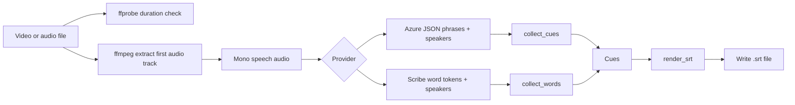
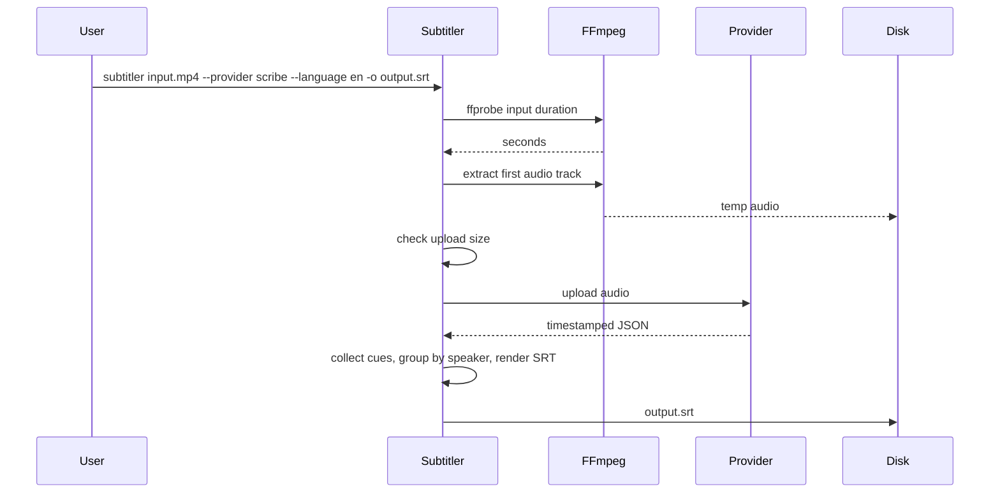

# System Design

`subtitler` is intentionally small. It turns a local media file into an SRT subtitle file, and can then translate that file into another language. Both stages run over the same cue model, and nothing else is in scope.

## Pipeline



`subtitler` does not upload the original video. It extracts one compact audio file and uploads only that.

## The cue is the contract

Every provider returns a list of `Cue` objects — `start_ms`, `end_ms`, `text`, and an optional `speaker` — never formatted text. Rendering, line wrapping, and speaker labelling then happen once, in `srt.py`, identically for all of them.

This matters for more than tidiness. Speaker labels are only useful if a cue never spans two voices, and that guarantee has to live in the cue-grouping code rather than in each provider. Every provider therefore reduces its response — Azure's phrase objects, Scribe's flat token stream — to the same `(start_ms, end_ms, text, speaker)` shape, and `group_words_into_cues` enforces the boundary once for all of them.

## Sequence



## ElevenLabs Scribe Provider

`--provider scribe` posts once to ElevenLabs and gets back word timings and speakers together:

```text
POST https://api.elevenlabs.io/v1/speech-to-text
xi-api-key: {ELEVENLABS_API_KEY}
model_id = scribe_v2
timestamps_granularity = word
diarize = true, num_speakers = {--max-speakers}
file = <extracted .mp3 audio>
```

The response is a flat token stream rather than phrases. Each token carries a `type` (`word`, `spacing`, or `audio_event`), start/end in **seconds**, and a `speaker_id` string. `elevenlabs_scribe.collect_words` keeps words and audio events, drops spacing, converts to milliseconds, and numbers the `speaker_id` strings into the integer ids cues use — after which it is the same cue list every other provider produces.

`--tag-audio-events` surfaces non-speech sounds as cues like `(laughter)`, which is useful for accessibility subtitles and off by default.

## Why not OpenAI

The `openai` provider was removed rather than migrated. None of the three candidates can produce well-timed subtitles:

- **`whisper-1`** emitted SRT directly and was the only OpenAI model with usable timing, but it is legacy and is removed on **2027-01-20**.
- **`gpt-transcribe`**, its recommended replacement, has *no timestamps at all* — OpenAI's docs state `timestamp_granularities[]` is supported only for `whisper-1`. It returns prose, so it cannot make subtitles.
- **`gpt-4o-transcribe-diarize`** has speakers and segment timing but no word timing. Measured on a three-minute clip it returned 91 segments of which only 29 were usable subtitle lengths: 24 were sub-0.3s slivers and 7 ran over six seconds — one was 17.4s covering three sentences, unsplittable without word timings. 69 of 180 seconds sat inside segments too long to display.

On accuracy OpenAI also trails: on the independent Artificial Analysis leaderboard `gpt-transcribe` scores 3.3% WER against MAI-Transcribe-1.5's 2.4% and Scribe v2's 2.2%.

## Azure MAI (internal only)

MAI-Transcribe-1.5 is reached through Azure Speech's LLM Speech REST API:

```text
POST {AZURE_SPEECH_ENDPOINT}/speechtotext/transcriptions:transcribe?api-version=2025-10-15
Ocp-Apim-Subscription-Key: {AZURE_SPEECH_API_KEY}
definition.enhancedMode.model = mai-transcribe-1.5
audio = <extracted .mp3 audio>
```

It produces cleaner transcript text than Azure's plain fast transcription (Scribe still edges it on WER — 2.2% against 2.4%), and it is **not offered as a `--provider` choice**. Two structural limits, neither tunable, make it unusable on its own:

- MAI returns only coarse, segment-level timestamps (no word-level timing). A three-minute clip comes back as a single 3,000-character cue spanning the whole file.
- Azure does not support diarization in enhanced mode, so MAI can never say who spoke.

So `azure_mai.py` survives purely as a building block: `azure_hybrid` calls its `build_definition` for the transcript pass and reuses its 43-language list and `request_language` fallback, and `cli.py` reads its spec for the `--azure-model` default. Its `SPEC` carries `internal=True`, which keeps it out of `providers.NAMES` — the tuple argparse uses for `--provider` choices — while leaving `providers.spec()` able to resolve it.

MAI is in public preview and supports 43 languages. When a requested `--language` isn't on its list, `subtitler` omits the locale hint so Azure can auto-detect. Run `subtitler --provider azure-hybrid --list-languages` to see the set.

## Diarization

`azure-fast` and `azure-hybrid` ask Azure to separate speakers by adding one key to the request definition:

```json
{"locales": ["en-US"], "diarization": {"enabled": true, "maxSpeakers": 8}}
```

Each returned phrase then carries a `speaker` integer, which `_azure_speech.py` attaches to every word it parses out of that phrase. Two things consume it:

1. `group_words_into_cues` treats a change of speaker as a hard cue boundary, so one subtitle never blends two voices. This is what stops an interruption ("But, I—" / "You don't wanna do that.") from merging into a single nonsensical line.
2. `render_srt` prefixes `- ` to each cue that starts a new turn — but only when the transcript actually contains two or more speakers, so diarizing a single-voice recording costs nothing in readability.

Scribe does the same thing with `diarize=true` and `num_speakers`, returning a `speaker_id` per token instead of per phrase; `elevenlabs_scribe.collect_words` normalizes that into the same integer speaker ids, so everything downstream is shared.

Diarization is on by default for every selectable provider. Azure bills it at no extra cost on fast transcription (the per-feature add-on applies to real-time only), and it requires mono audio, which the extraction step already produces. `--max-speakers` bounds the count (Azure accepts 2–35, Scribe up to 32); a tight bound on a two-person recording reduces the chance of one voice being split across two ids.

## Azure Hybrid Provider

`--provider azure-hybrid` produces subtitles that appear as each line is spoken, by running two passes over the same audio:

1. **MAI** (`enhancedMode`) for an accurate transcript — the *what*.
2. **Plain fast transcription** (no `enhancedMode`) for word-level timestamps and speaker ids — the *when* and the *who*.

A standalone module, `align.py`, then merges them: it diffs the two word sequences and transfers the fast-transcription timestamps onto MAI's wording, interpolating where the two tokenize differently (number formatting, dropped disfluencies, punctuation). The result is MAI-quality text at word-accurate times.

Speaker ids ride along the same path. Because MAI can't diarize at all, this is the only way to get MAI's wording attributed to speakers: a transcript word that matches a timed word takes that word's speaker; a rewritten run takes the dominant speaker of the span it replaced; an unmatched run inherits the speaker it abuts. Since the merged words then flow through `group_words_into_cues`, the speaker boundary splits cues here exactly as it does for `azure-fast`.

It bills two passes (see Cost Model). All Azure modes share one transcribe client in `providers/_azure_speech.py`; only the request `definition` differs.

## Azure Fast Provider

`--provider azure-fast` uses Azure's standard fast transcription (no `enhancedMode`), which returns word-level timestamps directly — so it produces in-sync SRT in a single pass with no alignment step. It's the right choice for languages MAI doesn't cover and for long files (up to 5 hours / 500 MB). Fast transcription expects region-qualified BCP-47 locales (`es-ES`, `en-US`); the provider maps common bare codes (`es` → `es-ES`) and otherwise auto-detects. Because MAI auto-detects unsupported languages — and can emit a different script than fast transcription does for languages written in more than one alphabet — `azure-hybrid` can't align them, which is why `azure-fast` is the better path outside MAI's language set.

## Cost Model

Pricing is per minute of input audio:

```text
cost = media_duration_minutes * price_per_minute_usd
```

`azure-fast` bills `$0.006`/minute — fast transcription is `$0.36`/hour, and
diarization is included at no extra cost on that tier (the per-feature add-on
applies only to real-time). MAI-Transcribe-1.5 is also `$0.36`/hour (the
Standard-Audio tier in LLM Speech enhanced mode), so `azure-hybrid`, which runs
both MAI and a fast pass, bills about `$0.012`/minute. ElevenLabs Scribe is
`$0.22`/hour, or about `$0.0037`/minute — the cheapest of the three. Each provider
declares its own rate in `providers/`.

Examples at `$0.006`/minute:

```text
10 minutes -> $0.06
60 minutes -> $0.36
120 minutes -> $0.72
```

The estimate is printed before upload.

## File Handling

The repository ships no media and no output directory. Both the input path and
the output path come from the caller; when `--output` is omitted, the run writes
to `outputs/<input-stem>.<language-or-auto>.srt` under the current directory and
creates that directory itself.

Anything local is deliberately ignored by git:

```text
samples/    local test media, if you keep any
outputs/    generated subtitles
.work/      optional persistent temp audio
```

The default temporary audio location is the OS temp directory. Pass `--work-dir .work` and `--keep-audio` if you want to inspect the extracted audio.

## Accuracy Levers

The important knobs for transcription accuracy are:

- `--language`: tell the provider the spoken language when known.
- Audio quality: the default `48k` AAC is chosen as a balance between speech quality and upload size.
- Source quality: background noise, music, overlapping speakers, and low-volume dialogue will hurt results.

If accuracy is poor, first try:

```sh
./subtitler input.mp4 --language en --audio-bitrate 96k --keep-audio --work-dir .work
```

If the audio file exceeds the upload limit, reduce bitrate or implement chunking.

## Model Landscape

Worth re-checking periodically; as of August 2026:

Independent word-error-rate ranking on the [Artificial Analysis leaderboard](https://artificialanalysis.ai/speech-to-text/non-streaming) (AA-WER, ~8h weighted 50% conversational / 25% VoxPopuli / 25% Earnings22):

```text
ElevenLabs Scribe v2   2.2%     <- `scribe`
MAI-Transcribe-1.5     2.4%     <- `azure-hybrid`'s text pass
GPT Transcribe         3.3%
GPT-4o Transcribe      4.0%
Whisper Large v3       4.1%
```

- **`gpt-4o-transcribe-diarize`** is the only OpenAI model that could return speakers; it accepts up to four `known_speaker_references` (2–10s audio clips), which would let cues carry real names rather than numbers. Its segment-only timing rules it out today (see Why not OpenAI), but if OpenAI adds word timestamps it becomes interesting again.
- **Named speakers** are the clearest gap in the current output. Scribe has a speaker library and role detection; neither is wired up here.

## Current Limitations

- Uses the first audio track only.
- Speaker ids are anonymous (`- ` turn markers, not names). Naming would need reference audio, which only the OpenAI diarize model currently accepts.
- Diarization quality degrades on overlapping speech — an industry-wide hard problem, not an Azure-specific one.
- No translation yet.
- No chunking yet; long or high-bitrate files can exceed the provider upload limit.
- No subtitle editing UI.
- No automatic QA beyond producing SRT and relying on manual review.

## Code Layout

The code is a small package under `src/subtitler/`, split by responsibility:

```text
cli.py        argument parsing and main() dispatch
config.py     RunConfig dataclass and argument resolution
pipeline.py   run(): probe -> extract audio -> transcribe -> render -> write SRT
media.py      ffmpeg/ffprobe and filesystem preconditions
srt.py        the Cue type, SRT rendering, line wrapping, cue grouping
align.py      merge a transcript's wording onto external word timings + speakers
errors.py     UserFacingError
providers/
  base.py            ProviderSpec + TranscriptionProvider abstraction
  azure_mai.py       MAI request builder + language list (internal; not selectable)
  azure_fast.py      Azure fast transcription (word timing + speakers, one pass)
  elevenlabs_scribe.py  ElevenLabs Scribe v2 (word timing + speakers, one pass)
  azure_hybrid.py    MAI text + fast-transcription timing/speakers, merged via align.py
  _azure_speech.py   shared Azure transcribe client + response parsing
  _http.py           multipart upload + error parsing helpers
tests/        stdlib unittest suite (python3 -m unittest discover tests)
```

Each provider exposes a `SPEC` (defaults, pricing, supported languages, whether it
can diarize, whether it's internal) and a `build(config)` factory, and implements
`transcribe(audio_path, timeout) -> list[Cue]`. The pipeline stays
provider-agnostic, so adding a provider is a new module under `providers/` plus an
entry in the registry. Setting `internal=True` on a spec keeps a provider
registered and reusable while hiding it from the command line.
